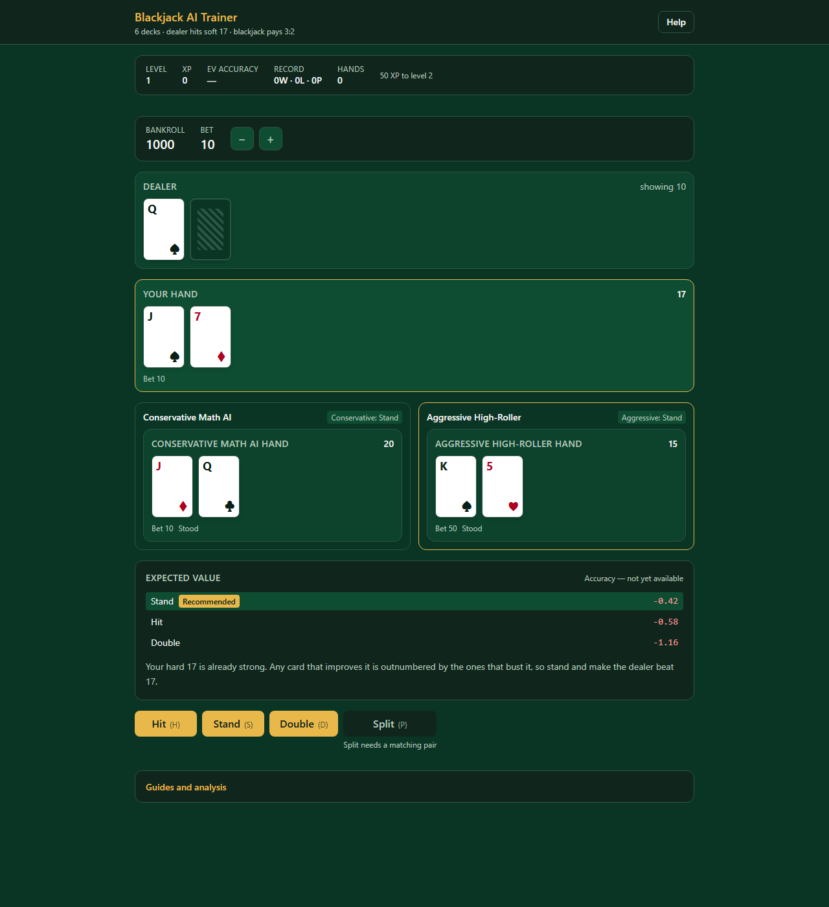
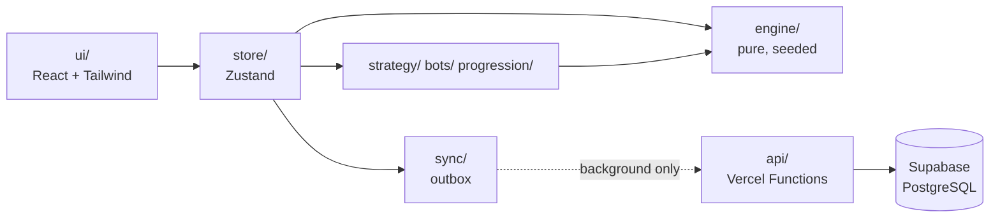

# Blackjack AI Trainer

[](https://github.com/diegoscpereira/p03-claude-code-blackjack-game/actions/workflows/ci.yml)
[](https://github.com/diegoscpereira/p03-claude-code-blackjack-game/actions/workflows/coverage.yml)

A browser Blackjack trainer that shows the **expected value of every legal action**, explains
why one is best, and seats two contrasting bots at the table.

**Live:** [p03-claude-code-blackjack-game.vercel.app](https://p03-claude-code-blackjack-game.vercel.app)



---

## What this project is really about

This is a **portfolio piece about working with Claude Code**, not a claim to be a TypeScript
specialist. The whole application was built by driving Claude Code through a spec-driven
workflow: I set the direction, made the product and architecture calls, reviewed the output,
and deployed it. Claude wrote the code, the tests, and the documents.

What I wanted to find out was whether an AI coding agent can be held to an engineering standard
rather than just asked for snippets — whether you can give it a written constitution, make it
plan before it builds, and enforce the result with gates it cannot talk its way past.

The repository is the answer, and it is meant to be read as much as run.

| | |
|---|---|
| **Tasks planned and completed** | 133 of 133, tracked in [`tasks.md`](specs/001-blackjack-ai-trainer/tasks.md) |
| **Tests** | 1,076 unit + integration, 56 end-to-end |
| **Coverage on the rules engine** | 98.8% (`src/engine`), 99.3% (`src/strategy`) |
| **CI gates** | 6, all blocking |
| **Architecture decision records** | 4, each naming the rejected alternative |
| **Requirements** | 80 functional, 11 non-functional, all traceable to a test |

---

## How it was built

Each step is a Claude Code command that produced a document, reviewed before the next one ran.
Nothing was written until the step before it was settled.

```
/speckit-constitution   →  the rules the project cannot break
/speckit-specify        →  what it must do, in requirements
/speckit-clarify        →  five ambiguities resolved before planning
/speckit-plan           →  architecture, stack, and the constitution check
/speckit-tasks          →  133 tasks, tests ordered before implementations
/speckit-analyze        →  cross-checked the documents against each other
/speckit-implement      →  built it, phase by phase
```

The artefacts are all in [`specs/001-blackjack-ai-trainer/`](specs/001-blackjack-ai-trainer/):

| Document | What it settles |
|---|---|
| [constitution.md](.specify/memory/constitution.md) | Four principles: code quality, test-first, UX consistency, performance |
| [spec.md](specs/001-blackjack-ai-trainer/spec.md) | Requirements and the five recorded clarifications |
| [research.md](specs/001-blackjack-ai-trainer/research.md) | Eight technical decisions with rejected alternatives |
| [plan.md](specs/001-blackjack-ai-trainer/plan.md) | Architecture and why Vite rather than Next.js |
| [data-model.md](specs/001-blackjack-ai-trainer/data-model.md) | The game model, the two tables, and why one value is deliberately not a column |
| [contracts/](specs/001-blackjack-ai-trainer/contracts/) | The engine API and the HTTP API |

**The constitution is the part that made the difference.** It sets numeric budgets — 100 ms to
respond to a click, 90% coverage on the rules, 30 seconds for the test suite — and every one
became a CI gate rather than an intention. When a module shipped without tests, coverage failed
the build. When a file grew past 400 lines, lint failed it. The agent could not negotiate with
either.

The feature work lands as one commit per user story, so the increments are reviewable in order
— followed by the fixes that deploying to production turned up.

---

## Architecture



**The dotted edge is the only network hop, and the only one allowed to fail.** Everything solid
is synchronous and local, so the game is fully playable offline after first load.

Progression is written to Supabase Postgres through the app's own serverless endpoints, never
from the browser — the database credential stays server-side, and a build gate scans the client
bundle to prove it. Writes go through a queue that survives a tab close and retries safely,
because every write is idempotent.

Imports point one way only, enforced by a lint rule *and* by
[a test](tests/unit/architecture.test.ts) that a `// eslint-disable` cannot silence. Full
walkthrough in [docs/architecture.md](docs/architecture.md).

---

## The part I'd point a reviewer at

The expected values are not estimates. Computing one exactly means recursing over every card
that could still come out of the shoe — far too slow to do while someone waits for a card.

So it runs **once, at build time**: a solver evaluates all 380 decision points into a 23.7 KB
table, and at runtime the app does a lookup. Microseconds instead of seconds, and identical on
every run.

The reason this is worth showing is what happened when it was checked against a published
strategy chart. The first run disagreed at exactly one cell out of 370 — soft 14 against a
dealer 4. The cause was a real bug: an Ace drawn onto an already-soft hand was being marked as
hard, which quietly shifted where soft doubling starts.

The rule written down in advance was *"a disagreement is a solver bug, never a chart
disagreement"* — so the solver got fixed and agreement went to 100%. Adjusting the expected
value to match would have hidden the defect and passed the test. Deciding that before seeing
the failure is what made it catch anything.

Details in [ADR 0001](docs/adr/0001-precomputed-ev-tables.md).

---

## What it does

- **Companion** — every legal action ranked by expected value, with the recommendation marked
  and explained in a sentence.
- **Two bots** — contrasting playstyles, acting on their own hands, skippable at any time.
- **Tutorial** — eight guided lessons for beginners, dismissable in one click, with nothing
  locked behind it.
- **Progression** — XP, ten levels, unlockable strategy charts, and lifetime statistics that
  survive a reload or a flight with no wifi.

Six decks, dealer hits soft 17, blackjack pays 3:2, double after split, resplit to four hands.
Play money only.

---

## Run it locally

```bash
npm install
npm run generate:ev    # the strategy tables are generated, not committed
npm run dev            # http://localhost:5173
```

No database needed — progression stays local and the sync indicator simply shows as pending,
which is the offline behaviour working as designed. Full setup, deployment, and the validation
checklist are in [quickstart.md](specs/001-blackjack-ai-trainer/quickstart.md).

```bash
npm run test           # 1,076 tests, ~5s
npm run test:e2e       # 56 browser tests
```

---

## Honest notes

**On the "AI" in the name.** Two different things, worth separating. The app was *built* with
AI. The intelligence *inside* it is decision-theoretic — an expected-value solver, strategy
tables, and rule-based bots. Nothing calls a language model at runtime; the explanations are
authored content resolved locally, a decision recorded in
[ADR 0003](docs/adr/0003-template-explanations.md) along with why generating them live would
have been the wrong trade.

**One performance budget is missed.** Background writes were budgeted at 300 ms and measure
594 ms at the 95th percentile against the live deployment. The cause is identified and written
down in [docs/architecture.md](docs/architecture.md) rather than quietly dropped. It does not
affect gameplay, because nothing you click ever waits on the network.

**Deploying found four defects that 1,000 passing tests did not** — module resolution,
dependency placement, a runtime pin, and database grants. All four were invisible locally and
obvious in production. Two were only diagnosable after adding server-side logging, because the
original error handling returned a plausible status and discarded the reason. That was a
design gap, and the fix is in the history.
