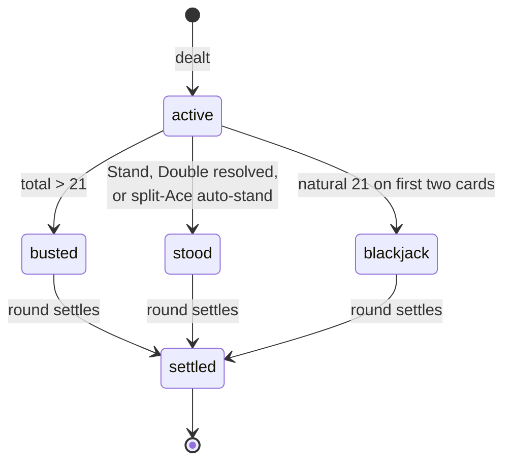

# Phase 1 Data Model: Web-Based Blackjack AI Trainer

**Date**: 2026-07-26 | **Plan**: [plan.md](./plan.md) | **Spec**: [spec.md](./spec.md)

Two distinct models, deliberately not unified: an **in-memory engine model** that exists only
during a round and is never persisted, and a **persistence model** of two flat tables. The
spec's System State & Database Boundary is the reason — anything that must survive is small,
append-only, and monotonic; everything else is transient.

---

## Part 1 — Engine model (in-memory, never persisted)

### Card

| Field | Type | Notes |
|---|---|---|
| `rank` | `'A'\|'2'…'10'\|'J'\|'Q'\|'K'` | Rank only; value derived, never stored |
| `suit` | `'♠'\|'♥'\|'♦'\|'♣'` | Presentation only; no rule depends on suit |

Card values are computed by `hand.ts`, not carried on the card. An Ace has no fixed value —
storing one would make FR-001's soft/hard logic ambiguous.

### Hand

| Field | Type | Validation |
|---|---|---|
| `id` | `string` | Unique within the round; split children get new ids |
| `cards` | `Card[]` | Length ≥ 1 once dealt |
| `bet` | `number` | > 0; doubled hands carry twice the original |
| `status` | `'active'\|'stood'\|'busted'\|'blackjack'\|'settled'` | See transitions below |
| `isSplitChild` | `boolean` | True for both hands produced by a split |
| `isSplitAce` | `boolean` | Drives the one-card-and-stand rule (FR-011) |
| `doubled` | `boolean` | Exactly one card may follow (FR-008) |

**Derived, never stored**: `total`, `isSoft`, `isBust`, `isNatural`. Deriving these is what
keeps FR-001 in one place.

**State transitions**:



A `busted` or `blackjack` hand never returns to `active`. This is the invariant the split
and resplit logic must not violate.

### RoundState

| Field | Type | Notes |
|---|---|---|
| `seed` | `number` | The round's seed — the whole round is reproducible from it |
| `shoe` | `Card[]` | Remaining cards; reshuffled only between rounds (FR-016) |
| `playerHands` | `Hand[]` | 1–4 (FR-010) |
| `activeHandIndex` | `number` | Which hand is acting |
| `dealerHand` | `Hand` | Hole card hidden until player hands resolve |
| `botSeats` | `BotSeat[]` | Bots and their hands; excluded from settlement (FR-035) |
| `phase` | `'betting'\|'dealing'\|'player'\|'bots'\|'dealer'\|'settled'` | Drives legal actions |
| `decisions` | `Decision[]` | Every player decision this round, for XP and logging |

**Invariants** (each becomes a test):
- `playerHands.length <= 4` at all times.
- A hand with `isSplitAce` has exactly 2 cards once resolved.
- A hand with `doubled` has exactly 3 cards, or 4 if split-then-doubled.
- `shoe.length` decreases monotonically within a round; it never grows mid-round.
- The sum of settled payouts equals the bankroll delta for the round.

### Decision

| Field | Type | Notes |
|---|---|---|
| `handId` | `string` | Which hand was acting |
| `playerTotal` | `number` | Snapshot at decision time |
| `isSoft` | `boolean` | Snapshot at decision time |
| `dealerUpcard` | `Card['rank']` | Snapshot at decision time |
| `chosen` | `Action` | What the player did |
| `recommended` | `Action` | What the companion advised |
| `matched` | `boolean` | `chosen === recommended` — drives FR-024a |

Automatic actions (the forced split-Ace stand) produce no `Decision`, per FR-024a's exclusion.

---

## Part 2 — Persistence model

Two tables. No RLS, no foreign keys to an auth schema, no triggers. Filtering is by
`player_id` alone (FR-065), and every query passes through `api/` (FR-068).

### `user_progress`

One row per player. Written by `PUT /api/progress` as monotonic maxima.

| Column | Type | Constraints | Source |
|---|---|---|---|
| `player_id` | `uuid` | PRIMARY KEY | Client-generated (FR-053) |
| `level` | `int` | NOT NULL, DEFAULT 1, 1–10 | FR-051d |
| `xp` | `bigint` | NOT NULL, DEFAULT 0, ≥ 0 | FR-050 |
| `hands_played` | `bigint` | NOT NULL, DEFAULT 0 | FR-052 |
| `wins` / `losses` / `pushes` | `bigint` | NOT NULL, DEFAULT 0 | FR-052 |
| `net_bankroll_change` | `bigint` | NOT NULL, DEFAULT 0 | FR-052; signed |
| `decisions_taken` | `bigint` | NOT NULL, DEFAULT 0 | FR-024a source of truth |
| `decisions_matched` | `bigint` | NOT NULL, DEFAULT 0 | FR-024a source of truth |
| `unlocks` | `text[]` | NOT NULL, DEFAULT `'{}'` | FR-051a; union on merge |
| `bankroll` | `bigint` | NOT NULL | Local value wins (boundary rule 4) |
| `bankroll_resets` | `int` | NOT NULL, DEFAULT 0 | FR-055 |
| `updated_at` | `timestamptz` | NOT NULL, DEFAULT `now()` | Diagnostics only |

**The EV accuracy score is not a column.** It is `decisions_matched / decisions_taken`,
computed on read. Storing it would create a value that can disagree with its own inputs after
a partial sync — exactly what FR-024a's counter-based definition avoids.

**Merge semantics** (`PUT /api/progress`): every counter takes `GREATEST(existing, incoming)`;
`unlocks` takes the array union; `bankroll` and `level` take the incoming value. This makes
the write idempotent and makes retry and reconciliation the same operation (R4).

### `hand_logs`

Append-only. Written by `POST /api/hands` in batches.

| Column | Type | Constraints | Source |
|---|---|---|---|
| `hand_id` | `uuid` | PRIMARY KEY | Client-generated; the idempotency key (FR-071) |
| `player_id` | `uuid` | NOT NULL, indexed | Scope for all reads |
| `played_at` | `timestamptz` | NOT NULL | Client timestamp; display only |
| `seed` | `bigint` | NOT NULL | Enables replay (FR-014, SC-008) |
| `dealer_upcard` | `text` | NOT NULL | Denormalised for analysis queries |
| `actions` | `jsonb` | NOT NULL | Ordered action list |
| `decisions` | `jsonb` | NOT NULL | Chosen vs recommended per decision (FR-067) |
| `final_totals` | `jsonb` | NOT NULL | Player hand totals and dealer total |
| `outcome` | `text` | NOT NULL, CHECK in (`win`,`loss`,`push`,`blackjack`,`bust`) | FR-013 |
| `net_change` | `int` | NOT NULL | Signed chips |

**Indexes**: PK on `hand_id`; `(player_id, played_at DESC)` for the post-game analysis view.
Nothing else — this table is written far more than it is read.

**Retention**: not addressed in Phase 1. Flagged in the clarification coverage summary as an
outstanding low-impact item; revisit before any public launch.

### Schema sketch

Full DDL lives in `supabase/schema.sql`. Shape:

```sql
create table user_progress (
  player_id uuid primary key,
  level int not null default 1 check (level between 1 and 10),
  xp bigint not null default 0 check (xp >= 0),
  -- … counters as above …
  unlocks text[] not null default '{}',
  updated_at timestamptz not null default now()
);

create table hand_logs (
  hand_id uuid primary key,
  player_id uuid not null,
  -- … columns as above …
);

create index hand_logs_player_time on hand_logs (player_id, played_at desc);
-- No RLS policies. Access is exclusively via server-side endpoints (FR-068).
```

---

## Part 3 — Local-only state

Never sent to the server.

| Key | Storage | Contents |
|---|---|---|
| `bj.player_id` | `localStorage` | The generated UUID (FR-053, FR-066) |
| `bj.tutorial` | `localStorage` | `{ dismissed, completed, lastStep }` (FR-043, FR-046) |
| `bj.outbox` | `localStorage` | Queued hand logs and progress deltas (R5), capped at 500 |

`bj.outbox` is the only one that can grow. Its cap is a constitutional requirement (bounded
memory), not a nicety.

---

## Requirement traceability

| Entity / field | Requirements |
|---|---|
| `Hand.isSplitAce`, `doubled` | FR-008, FR-009, FR-011 |
| `RoundState.shoe`, `seed` | FR-004, FR-014, FR-016, SC-008 |
| `Decision.matched` | FR-024, FR-024a, FR-050 |
| `user_progress` counters | FR-024a, FR-052, boundary rule 4 |
| `user_progress.unlocks` | FR-051, FR-051a, FR-051b |
| `hand_logs.hand_id` | FR-071 (idempotency) |
| `hand_logs.seed`, `actions` | FR-067, User Story 7 |
| No PII in either table | FR-054 |
