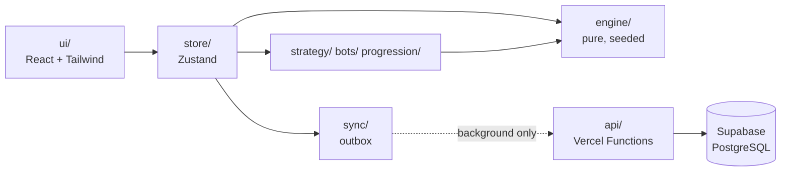
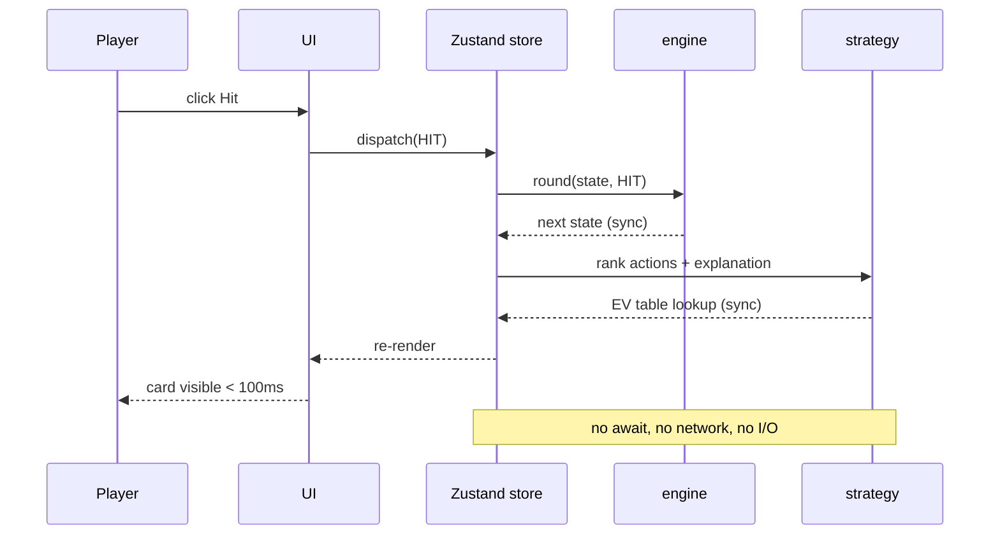
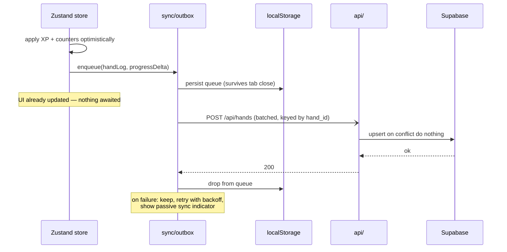

# Implementation Plan: Web-Based Blackjack AI Trainer

**Branch**: `001-blackjack-ai-trainer` | **Date**: 2026-07-26 | **Spec**: [spec.md](./spec.md)

**Input**: Feature specification from `/specs/001-blackjack-ai-trainer/spec.md`

## Summary

A single-page React application that deals and settles Blackjack entirely in the browser
against a pure, seeded TypeScript engine, advises the player from precomputed expected-value
tables, seats two contrasting bot agents at the table, and persists progression to PostgreSQL
through the app's own serverless endpoints — never on an interactive path.

The architecture follows one rule that everything else derives from: **the network is never
between a player and their next card.** The engine, the strategy tables, and the explanation
library are all local and synchronous; persistence is an append-only outbox that drains in
the background and can fail indefinitely without a player noticing.

## Technical Context

**Language/Version**: TypeScript 5.x, strict mode, with `noImplicitAny` and
`noUncheckedIndexedAccess` enabled. Node 20+ for tooling and serverless handlers.

**Primary Dependencies**: React 18, Vite 5 (build), Tailwind CSS 3, Zustand 4 (client
store), `@supabase/supabase-js` (server-side only). No router, data-fetching library, or
component kit beyond these.

**Storage**: Supabase PostgreSQL, two flat tables (`user_progress`, `hand_logs`), no RLS.
Client-side durable queue in `localStorage` for the sync outbox and player identity.

**Testing**: Vitest (unit + integration, jsdom for component tests), React Testing Library,
Playwright (end-to-end). V8 coverage with a 90% threshold enforced on `src/engine` and
`src/strategy`.

**Target Platform**: Evergreen desktop and mobile browsers, 360px–1920px. Deployed as a
Vercel static build plus Vercel Functions under `api/`.

**Project Type**: Single-page web application with a thin serverless persistence tier.

**Performance Goals**: p95 input→render < 100ms; first load to interactive table < 2s; EV
lookup plus explanation resolution < 100ms (achieved by table lookup, not computation);
background write round trip < 300ms p95.

**Constraints**: Fully playable offline after first load. No database credential in the
client bundle. Engine importable and testable without a browser. Unit/engine suite < 30s.

**Scale/Scope**: Single-player play-money trainer. 7 user stories, 80 functional
requirements, 11 non-functional. No concurrency beyond one player across two tabs.

## Constitution Check

*GATE: Must pass before Phase 0 research. Re-check after Phase 1 design.*

Checked against constitution **v2.0.0**.

- [x] **I. Code Quality**: `src/engine` and `src/strategy` import nothing from `src/ui`,
      `src/store`, `src/sync`, or `api/` — enforced by an ESLint `no-restricted-imports`
      boundary rule, not by convention. Randomness enters through an injected `Rng`
      interface. Strict TypeScript with no implicit `any`. Module and function size caps
      respected; no exemption requested.
- [x] **II. Test-First (NON-NEGOTIABLE)**: Every task producing engine or strategy behaviour
      is preceded by its failing test. Engine tests run in Node with a fixed seed — no
      clock, no viewport, no network. The coverage threshold is a build gate, so a drop
      below 90% fails CI rather than being noticed in review.
- [x] **III. UX Consistency**: One action vocabulary defined once in `src/engine/types.ts`
      and imported by every layer, so a rename cannot drift. The engine returns the legal
      action set; the UI renders only those, disabling with a stated reason. No modal is used
      during a hand — sync failures surface as a passive indicator. Keyboard operability and
      WCAG AA contrast have dedicated tests. Bot pacing is a cancellable timer, interruptible
      per FR-036.
- [x] **IV. Performance**: EV is a build-time-generated lookup, not a runtime computation — a
      hash lookup, microseconds not milliseconds. Nothing on an interactive path awaits the
      network: the outbox is fire-and-forget. Pacing (deal animation, 600ms bot window) is
      excluded from the 100ms budget and is interruptible. The unit/engine suite stays under
      30s; Playwright is a separate npm script and a separate CI job, exempt by Principle IV.
- [x] **Constraints**: Strict TypeScript. Engine testable in Node without a browser.
      Serverless handlers hold no state between invocations. Local state authoritative during
      play. Playable offline after first load — no runtime service call exists on any
      gameplay path.
- [x] **Data safety**: The Supabase key lives only in Vercel server-side environment
      configuration, read exclusively inside `api/`. No `VITE_`-prefixed variable carries a
      credential — Vite only inlines that prefix, so the boundary is structural rather than
      procedural. Stored rows contain a generated UUID, counters, and hand outcomes; no
      personal data.

**Result: all six gates pass. Complexity Tracking is empty.**

## Project Structure

### Documentation (this feature)

```text
specs/001-blackjack-ai-trainer/
├── plan.md              # This file
├── spec.md              # Feature specification
├── research.md          # Phase 0 output
├── data-model.md        # Phase 1 output
├── quickstart.md        # Phase 1 output
├── contracts/           # Phase 1 output
│   ├── engine-api.md
│   └── http-api.md
├── checklists/
│   └── requirements.md
└── tasks.md             # Phase 2 output (/speckit-tasks — not created here)
```

### Source Code (repository root)

```text
├── .github/
│   └── workflows/
│       └── ci.yml                  # typecheck → lint → unit → coverage → bundle scan → e2e
├── api/                            # Vercel Functions — the only code holding DB credentials
│   ├── progress.ts                 # GET/PUT player progression
│   └── hands.ts                    # POST hand-log batch (idempotent)
├── docs/
│   ├── architecture.md             # diagrams below, expanded
│   ├── adr/                        # one file per significant decision
│   └── screenshots/
├── public/
├── scripts/
│   └── generate-ev-tables.ts       # build-time EV solver → src/strategy/data/*.json
├── src/
│   ├── engine/                     # PURE. No React, no network, no DOM, no clock.
│   │   ├── types.ts                # Card, Hand, Action, RoundState, Outcome
│   │   ├── rng.ts                  # seeded PRNG behind an Rng interface
│   │   ├── shoe.ts                 # build, shuffle, draw, penetration
│   │   ├── hand.ts                 # totals, soft/hard, blackjack detection
│   │   ├── rules.ts                # legal actions for a state
│   │   ├── round.ts                # reducer: (state, action) → state
│   │   ├── dealer.ts               # dealer play, hits soft 17
│   │   └── settle.ts               # payouts, 3:2 naturals, pushes
│   ├── strategy/
│   │   ├── chart.ts                # basic strategy lookup
│   │   ├── ev.ts                   # EV lookup + action ranking
│   │   ├── explanations.ts         # library resolution
│   │   └── data/                   # generated: ev-tables.json, explanations.json
│   ├── bots/
│   │   ├── profiles.ts             # Conservative Math AI, Aggressive High-Roller
│   │   └── decide.ts               # (profile, state, rng) → action
│   ├── progression/
│   │   ├── xp.ts                   # award rules (FR-050)
│   │   └── levels.ts               # the 10-level ladder (FR-051d)
│   ├── sync/
│   │   ├── outbox.ts               # durable queue, retry, idempotency keys
│   │   ├── client.ts               # fetch wrapper for /api
│   │   └── identity.ts             # player UUID create/read
│   ├── store/
│   │   └── gameStore.ts            # Zustand: engine state + UI state + outbox triggers
│   ├── ui/
│   │   ├── table/                  # Table, Hand, Card, Controls, BotSeat
│   │   ├── companion/              # EV panel, recommendation, explanation
│   │   ├── tutorial/               # lesson steps, dismiss control
│   │   ├── guides/                 # unlockable chart views
│   │   └── common/                 # Button, Badge, SyncIndicator
│   ├── App.tsx
│   └── main.tsx
├── supabase/
│   └── schema.sql                  # two tables, no RLS — see data-model.md
├── tests/
│   ├── unit/                       # engine, strategy, progression, bots (Node, seeded)
│   ├── integration/                # full round loops, outbox behaviour, store wiring
│   └── e2e/                        # Playwright: skip tutorial, play a hand, offline
├── .env.example
├── vercel.json
├── vite.config.ts
├── tsconfig.json
└── README.md
```

**Repository root**: the git root — currently `jornada_de_dados_claude_code_projeto03/`. Task
T001 moves `.specify/`, `.claude/`, and `specs/` up from `claude_code_blackjack_project/` and
removes the Python placeholder scaffold, so the application sits at the top level of the
repository. Every path in this plan and in `tasks.md` is relative to that root.

**Structure Decision**: A single Vite SPA with a four-layer dependency gradient —
`engine` → `strategy`/`bots`/`progression` → `store`/`sync` → `ui` — where imports only ever
point left. `api/` is a separate root-level tree because Vercel treats it as a distinct build
target, which has the useful side effect of making the credential boundary visible in the
directory listing rather than buried in a config file.

## System Architecture & Data Flow

### Layering



The dotted edge is the only network hop, and the only edge that may fail without
consequence. Everything solid is synchronous and local.

### Interactive path — a player clicks Hit



### Persistence path — after a hand settles



### State ownership

| State | Owner | Persisted | Notes |
|---|---|---|---|
| Shoe, hands, turn, legal actions | `engine` via store | No | Lost on refresh by design (spec boundary rule 5) |
| Bankroll, current bet | store | Via progress sync | Local value wins on conflict |
| Recommendation, EV, explanation | `strategy`, derived | No | Recomputed from state; never stored |
| XP, level, counters, unlocks | store | Yes | Monotonic; higher value wins |
| Hand logs | outbox → DB | Yes | Append-only, idempotent by `hand_id` |
| Tutorial position, player UUID | `localStorage` | No (device-scoped) | Identity is device-scoped by spec |

## Tech Stack Decisions & Rationale

| Decision | Rationale | Alternative rejected |
|---|---|---|
| **Vite over Next.js** | The app is a client-side game with two trivial endpoints. Next.js brings SSR, routing, and a server runtime that a seeded local engine cannot use. Vite's dev server also starts fast, which matters when the test loop is the product. | Next.js — justified only with SSR or a large API surface; neither applies. |
| **Vercel Functions in `api/`** | Keeps the DB credential server-side (Data Safety gate) in roughly 60 lines of handler code, with a static Vite build and no framework adoption. | Direct browser→Supabase — rejected in clarification Q2: with no RLS, a browser key is unrestricted across all rows. |
| **Zustand over Redux/Context** | One store, no provider tree, no boilerplate; selectors keep re-renders scoped, which is how the 100ms budget survives contact with React. | Redux Toolkit — ceremony without benefit at this size. Context — re-renders the tree on every card. |
| **Precomputed EV tables** | The largest decision here. Exact EV per decision point is a recursive shoe computation; running it per click risks the 100ms budget. Solving once at build time reduces runtime to a hash lookup and makes results trivially deterministic and testable. ~1,900 values, ≈40KB JSON. | Runtime solver — rejected on latency and determinism. Chart-only — gives the recommendation but not the EV numbers FR-022 requires. |
| **Vitest over Jest** | Shares Vite's transform pipeline: one config, no separate Babel path, meaningfully faster — which the 30s constitutional budget makes load-bearing. | Jest — extra toolchain for no gain here. |
| **Playwright over Cypress** | Real offline emulation (`context.setOffline`) is needed to test NFR-007 honestly, and it runs headless in CI cleanly. | Cypress — offline simulation is awkward. |
| **Tailwind** | Requested. Also keeps contrast tokens in one config, so the WCAG AA gate is checkable in one place. | — |
| **`localStorage` outbox over IndexedDB** | The queue holds tens of small records. `localStorage` is synchronous, which suits an enqueue that must not await. | IndexedDB — correct at scale, overkill here. |

## Testing Strategy

Three tiers, mapped to the constitution's two budgets.

**Unit — `tests/unit/`, Vitest, Node environment, no DOM.** The bulk of the suite, and where
correctness actually lives.

- *Engine*: hand totals including soft/hard aces; legal-action sets per state; each action's
  transition; split and resplit limits; split-Ace one-card-and-stand; dealer hits soft 17;
  settlement including 3:2 naturals and pushes; reshuffle only between rounds.
- *Determinism*: same seed → same shoe, asserted across repeated runs (FR-004, SC-008).
- *Strategy*: every decision point in the reference chart matches the EV table's top action
  (FR-021) — table-driven over the whole chart, not a sample.
- *Explanations*: 100% chart coverage with no missing keys (FR-028, SC-010); same input →
  same text (FR-029).
- *Progression*: XP awards, threshold crossing, multi-level crossing from one award, the
  level-10 ceiling (FR-050, FR-051, FR-051d/e).
- *Bots*: each profile's decisions reproducible from a seed and consistent with its
  documented profile (FR-031).

**Integration — `tests/integration/`, Vitest, jsdom.** Whole loops through the store.

- A full round end to end: bet → deal → player actions → bot turns → dealer → settle → XP
  applied → outbox enqueued.
- Outbox behaviour: the queue survives a simulated reload; retry after failure; a retried
  write produces exactly one log and no double-counted counter (FR-071).
- Reconciliation: local and remote counters converge to the higher value; bankroll takes
  local.
- Bot pacing: turns collapse on input, and the collapsed outcome equals the un-collapsed one
  (FR-036, FR-037).

**End-to-end — `tests/e2e/`, Playwright.** Exempt from the 30s budget; separate CI job.

- Skip the tutorial in one interaction and play a hand (User Story 2, SC-002).
- Complete the tutorial; separately, resume mid-tutorial from the help menu.
- Go offline mid-hand: the hand completes, the indicator appears, results sync on reconnect
  (SC-006).
- Keyboard-only play through a complete hand (NFR-008).
- Level-up grants a guide without a reload.

**CI gates**, in order, matching the constitution's six: typecheck → lint (including the
import-boundary rule) → unit + integration → coverage threshold on `engine`/`strategy` →
bundle scan asserting no credential string is present → e2e.

## Repository Presentation (portfolio)

The spec's User Story 7 makes the repository itself a deliverable.

- **`README.md`**: what it is, a screenshot, a live link, the architecture diagram above, a
  30-second local start, and a short "how the EV engine works" section. The SDD trail —
  constitution → spec → clarify → plan → tasks — gets its own section linking into
  `specs/001-blackjack-ai-trainer/`, since that artifact trail is the differentiator.
- **`docs/adr/`**: short records for the four decisions a reviewer would otherwise question —
  precomputed EV tables, no-RLS with server-side proxying, template explanations over runtime
  LLM, and device-scoped identity. Each states the rejected alternative.
- **CI and coverage badges** on the README, both real.
- **Conventional commits**, one PR per user story, so the history reads as increments.

**One honest note on framing.** Clarification D1 removed runtime LLM generation from Phase 1,
while the plan input mentions "LLM API call" wrappers. The `api/` directory is structured so
such a route could be added later without touching the game path — but nothing in Phase 1
calls a model. If this repository is meant to demonstrate *LLM* engineering specifically, the
AI content here is decision-theoretic (EV solver, strategy tables, bot agents), not
generative. That is a defensible and arguably more rigorous portfolio story, but it is a
different one, and the README should say which it is rather than letting "AI" do ambiguous
work.

## Complexity Tracking

> **Fill ONLY if Constitution Check has violations that must be justified**

No violations. All six gates pass against constitution v2.0.0; this table is intentionally
empty.
