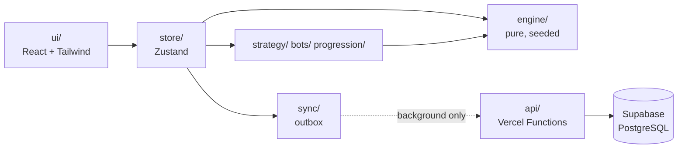
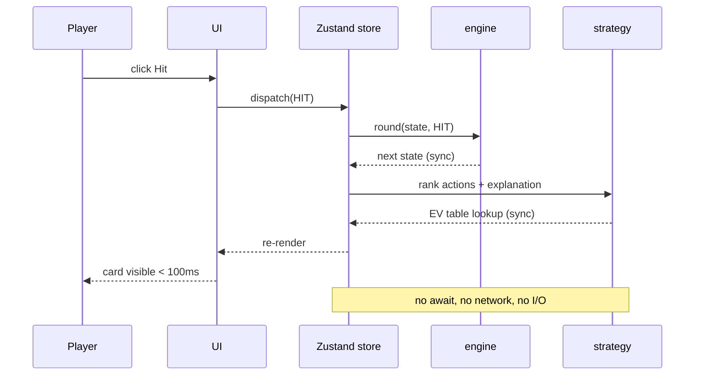
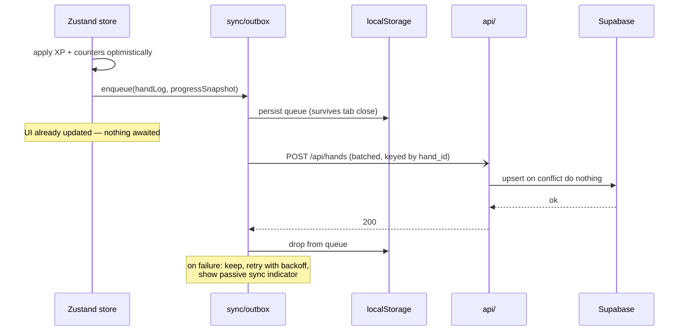

# Architecture

Everything here derives from one rule:

> **The network is never between a player and their next card.**

The engine, the strategy tables, and the explanation library are local and synchronous.
Persistence is an append-only outbox that drains in the background and can fail indefinitely
without a player noticing. Every layering decision below is a consequence of that sentence.

---

## The layers

Imports point left and never right. The dotted edge is the only network hop and the only edge
permitted to fail.

| Layer | May import | Holds |
|---|---|---|
| `engine/` | itself only | Rules, shoe, dealer, settlement, replay. Pure. |
| `strategy/` | `engine/` | EV lookup, chart, explanations. Pure. |
| `bots/`, `progression/` | `engine/`, `strategy/` | Bot policies, XP, the level ladder. Pure. |
| `sync/` | `progression/` | Identity, the durable outbox, the fetch wrapper, reconciliation. |
| `store/` | everything below | The one place impurity lives: clock, UUIDs, timers, bankroll. |
| `ui/` | `store/` | React. Reads state, dispatches actions, renders. |
| `api/` | `src/progression/` (pure merge rule only) | The only code holding a database credential. |

### Why the engine is pure, and what that buys

Constitution Principle I requires that modules deciding hand values, legal actions, and payouts
perform no I/O, touch no DOM, read no clock, and consume no unseeded randomness. That sounds
like hygiene. It is actually what makes four separate claims in this repository true at once:

- **The engine tests run in Node with no DOM** — so an accidental `react` import breaks them
  loudly instead of being papered over by a jsdom global.
- **Every hand replays from its seed** (SC-008). `applyAction` consumes no randomness at all;
  the shuffle in `startRound` takes the round's entire randomness budget. So the seed fixes the
  shoe and the action list fixes everything drawn from it. `src/engine/replay.ts` is thirty
  lines of consequence, not thirty lines of machinery.
- **Bots are bound by exactly the player's rules**, because `playBots` presents a bot's hand to
  the same reducer rather than reimplementing legality.
- **The 100 ms budget is met by construction**, because there is no code path on which a card
  could await anything.

### How the boundary is actually enforced

Two independent mechanisms, deliberately:

1. **ESLint** `no-restricted-imports` zone rules on `src/engine/**` and `src/strategy/**`,
   plus `no-restricted-globals` for `fetch`, `window`, `document`, `localStorage`, and
   `no-restricted-properties` for `Math.random` and `Date.now` (research.md R6).
2. **[`tests/unit/architecture.test.ts`](../tests/unit/architecture.test.ts)**, which reads the
   source files and asserts the same rules.

The second exists because the first is configuration, and configuration can be relaxed by the
same commit that violates it — an `// eslint-disable-next-line` is one keystroke and reads as
routine in a diff. A test cannot be silenced from inside the file it is judging.

---

## The interactive path — a player clicks Hit

There is no `await` anywhere on this path, and that is a structural property rather than a
performance optimisation: the strategy layer is forbidden from importing `fetch`, so a future
change *cannot* quietly introduce one without failing lint and a test.

**Two things sit outside the 100 ms budget**, both by explicit constitutional exemption, and
both interruptible: the deal animation, and the 600 ms bot turn window. The bots have already
resolved completely by the time the window starts — it reveals history rather than making it,
which is why skipping it cannot change an outcome (FR-037).

---

## The persistence path — after a hand settles

`enqueue` is synchronous — it writes to `localStorage` and returns. That single requirement is
why the outbox is not built on IndexedDB, whose async API would put an `await` on the
settlement path (research.md R5).

### Why retries are safe

Every write is idempotent, so a retry after an ambiguous failure is a no-op rather than a
correctness bug (R4):

- **Hand logs** carry a client-generated `hand_id` and insert with `ON CONFLICT DO NOTHING`.
  `skipped: 1` in the response is a normal outcome, not a warning.
- **Progression counters are absolute totals, never deltas.** The same payload applied twice
  produces the same row. Sending deltas would make every timeout a silent inflation, invisible
  until someone audited the totals.

That choice has a second payoff: reconciliation on reconnect and retry after failure become
*the same operation*, so there is one merge rule rather than two that must agree.

### The asymmetry in reconciliation

Boundary rule 4 is easy to get wrong by treating "merge" as one operation:

| Field | Rule | Why |
|---|---|---|
| `xp`, `hands_played`, `wins`, `losses`, `pushes`, `decisions_*`, `bankroll_resets` | higher wins | Lifetime totals only grow, so the maximum can never lose information |
| `unlocks` | union, in ladder order | Earned on either side is earned |
| `level` | recomputed from merged `xp` | Merging levels directly could produce a level disagreeing with its own XP |
| `bankroll`, `net_bankroll_change` | local wins | A *current* value that moves both ways — "higher wins" would hand out free chips on every reconnect |

The EV accuracy score is never reconciled: it is `decisions_matched / decisions_taken`, computed
on read. Stored, it could disagree with its own inputs after a partial sync.

---

## State ownership

| State | Owner | Persisted | Notes |
|---|---|---|---|
| Shoe, hands, turn, legal actions | `engine` via store | No | Lost on refresh by design (boundary rule 5) |
| Bankroll, current bet | store | Via progress sync | Local value wins on conflict |
| Recommendation, EV, explanation | `strategy`, derived | No | Recomputed from state; never stored |
| XP, level, counters, unlocks | store | Yes | Monotonic; higher value wins |
| Hand logs | outbox → DB | Yes | Append-only, idempotent by `hand_id` |
| Recent hands (analysis view) | store | No | Capped at 50 — bounded memory (Principle IV) |
| Tutorial position, player UUID | `localStorage` | No | Device-scoped by spec |

Every local read goes through `src/sync/storage.ts`, which tolerates absence, malformed JSON, a
truncated write, and an unknown schema version by falling back to defaults. The constitution
requires it, and [`tests/unit/sync/corruption.test.ts`](../tests/unit/sync/corruption.test.ts)
applies the same three insults to all three keys and then asserts the app still reaches a
playable table.

---

## Performance budgets — measured

> Constitution Principle IV: *"Performance budgets MUST be verified by measurement, not
> asserted."*

Measured by [`tests/e2e/performance.spec.ts`](../tests/e2e/performance.spec.ts), which prints
these numbers and **fails if a budget is exceeded** — so they are a gate, not a snapshot that
rots. Timings are taken inside the page with `performance.now()` and a `requestAnimationFrame`
check, so they measure to *painted*, not merely to dispatched.

| Budget | Requirement | Measured (p95) | Median | n |
|---|---|---|---|---|
| Input → rendered card | NFR-001, < 100 ms | **14.4 ms** | 11.4 ms | 51 |
| Settle + progression + enqueue, synchronous | NFR-001 | **0.8 ms** | 0.3 ms | 15 |
| First load → interactive table | NFR-004, < 2 s | **46 ms** ¹ | 18.5 ms | 5 |
| Settlement → visible in post-game analysis | SC-005, < 5 s at 95% | **12.2 ms** | 10.9 ms | 10 |
| Unit + integration suite wall time | Principle IV, < 30 s | **3.4 s** | — | 1,051 tests |
| Background write round trip | NFR-003, < 300 ms p95 | *not measurable locally* ² | — | — |

¹ Against a local preview server, so this excludes network transfer. The client bundle is
**221.9 KB of JavaScript (70.8 KB gzipped)** and 14.2 KB of CSS (3.6 KB gzipped), which
includes the 23.7 KB EV table inlined at build time. On a 10 Mbps connection that transfer is
roughly 70 ms, leaving the 2-second budget with well over an order of magnitude of headroom.
The honest claim is that the *application* costs ~46 ms; the network cost depends on the
connection and is bounded by the bundle size above.

² NFR-003 is a property of a deployed edge region, not of a preview server, and measuring it
here would produce a number that means nothing. It is outstanding until T130 deploys. What
*is* measured is the part this repository controls — the client-side cost of the write path,
which is the 0.8 ms row above, because `enqueue` is synchronous and nothing on the settlement
path awaits the network.

**Why the input path has this much headroom** is worth stating, because it is design rather
than tuning. There is no computation on it: expected values are a hash lookup into a
build-time table (ADR 0001), the engine reducer is a pure function over the state, and the
explanation is a keyed lookup (ADR 0003). The 14 ms measured is React reconciliation and paint,
not the game.

The two deliberate delays — the deal animation and the 600 ms bot turn window — are excluded by
Principle IV and are cancelled by any input, so they never appear in these samples.

---

## The quality gates

Six, in constitutional order, in [`.github/workflows/ci.yml`](../.github/workflows/ci.yml):

1. Lint, including the import-boundary rule and the 400-line / 50-line size caps.
2. Typecheck, strict, with `noUncheckedIndexedAccess`.
3. Unit and integration tests — 1,051 of them, budgeted at 30 seconds.
4. Coverage ≥ 90% on `src/engine` and `src/strategy`.
5. Bundle credential scan — fails if `SUPABASE_SERVICE` or a key value reaches `dist/`.
6. End-to-end tests, as a separate job so they never gate the fast feedback loop.

The size caps are lint errors rather than review opinions, which is why `gameStore.ts` grew a
`progression.ts` sibling rather than a fourth screen of scrolling.
